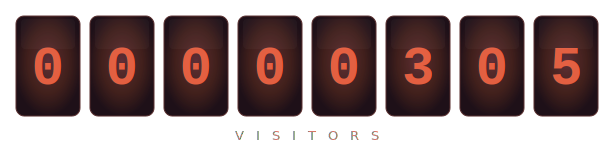

---

### ⚡ Tech Stack

<table width="100%">
<tr>
<td align="center" width="33%">
<h4>🦀 Languages</h4>
 
&nbsp;&nbsp;
&nbsp;&nbsp;

  
</td>
<td align="center" width="33%">
<h4>🔩 Embedded & Hardware</h4>
 

 

 

&nbsp;

  
</td>
<td align="center" width="33%">
<h4>🖥️ Frameworks & Tools</h4>
 
&nbsp;&nbsp;
&nbsp;&nbsp;

  
&nbsp;&nbsp;

  
</td>
</tr>
</table>

---

